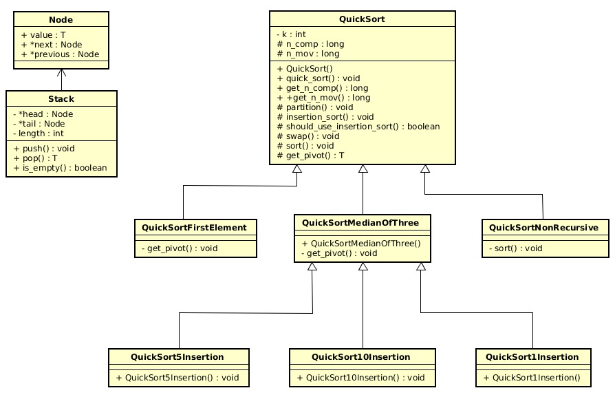

### 
 Trabalho Estrutura de Dados

#### 
Flávio Lúcio Corrêa Júnior 

**
Universidade Federal de Minas Gerais (UFMG) 
**
**
Belo Horizonte - MG - Brazil
**

---

- ### **Sumário**:

  **1. Introdução**

  **2. Implementação**

  **3. Análise Experimental**

  **4. Conclusão**

  **5. Bibliografia**

---

## 1 Introdução

O trabalho consiste em implementar variações do algoritmo QuickSort e fazer uma análise comparativa de seus respectivos melhores e piores casos. Para isso, analisaremos as seguintes implementações:

- **QuickSort Clássico:** seleção de pivô usando o elemento central.
- **QuickSort Primeiro Elemento:** seleção do pivô como sendo o primeiro elemento do subconjunto.
- **QuickSort Mediana de 3:** seleção do pivô usando a “mediana de três” elementos, em que o pivô é escolhido usando a mediana entre a chave mais à esquerda, a chave mais à direita e a chave central (como no algoritmo clássico).
- **QuickSort Inserção 1%:** o processo de partição é interrompido quando o subvetor tiver menos de k = 1% chaves. A partição então deve ser ordenada usando uma implementação especial do algoritmo de ordenação por inserção, preparada para ordenar um subvetor. Seleção de pivô é feita usando a “mediana de três” elementos, descrita acima.
- **QuickSort Inserção 5%:** mesmo que o anterior, com k = 5%
- **QuickSort Inserção 10%:** mesmo que o anterior, com k = 10%
- **QuickSort Não Recursivo:** implementação que não usa recursividade. Utiliza pilha para simular as chamadas de função recursivas e identificar os intervalos a serem ordenados a cada momento. A seleção do pivô deve ser feita assim como no Quicksort clássico.

## 2 Implementação:

No geral, o programa desenvolvido aceita uma entrada do tipo `./nomedoprograma <variacao> <tipo> <tamanho> [-p]` e produz uma saída `<variacao> <tipo> <tamanho> <n_comp> <n_mov> <tempo>,` onde `variacao`, `tipo` e `tamanho` são os parâmetros recebidos na entrada, `n_comp` e `n_mov` se referem ao número médio de comparações de chaves e de movimentações de registros efetuadas e `tempo` ao tempo mediano de execução, em microssegundos.

### **2.1 Estruturas de dados:**

- **Pilha:**
  - **Uso**: memória auxiliar para execução do Quicksort não recursivo.
  - **Motivo de escolha:** característica FILO (first in last out) que facilita a execução do algoritmo, operações push e pop com complexidade de tempo constantes.
- **Vetor:**
  - **Uso**: armazenar os elementos que serão ordenados pelo algoritmo.
  - **Motivo de escolha:** estrutura a ser ordenada, exigida pela descrição do trabalho

### **2.2 Classes:**

- Diagrama de Classes UML

### **2.3 Principais Funções:**

- `void quick_sort(T *array, int size)`: esta função simplismente inicializa as variáveis acumuladoras dos números de comparações e movimentações com elementos do vetor e faz a primeira chamada da função recursiva `sort()`.
- `virtual void sort(int ini, int end, T *array, int size)`: função recursiva executada para cada partição criada pela chamada do procedimento `partition()`, esta é declarada como um método virtual pois a sub-classe `QuickSortNonRecursive` utiliza sua implementação não recursiva;
- `void partition(int ini, int end, int &i, int &j, T *array)`: principal função do algoritmo, aqui é onde acontece a separação (partição) dos elementos do vetor que são maiores e menores do que um pivot especificamente escolhido. Tal procedimento é executado armazenando 2 indices (um que começa na posição inicial e outro na final do vetor) que são usados para iterar sobre os elementos e efetuar a troca de suas posições quando necessário.
- `void insertion_sort(int ini, int end, T *array)`: esta função é uma implementação do algoritmo Insertion Sort que é usado de maneira híbrida com o Quick Sort nas classes `QuickSortXInsertion` onde X pode assumir o valor de 1, 5 ou 10 como descrito acima.
- `virtual T get_pivot(int ini, int end, T *array)`: função virtual pois podemos ter 3 diferentes métodos de obter tal pivot, cada uma dessas 3 maneiras é implementada nas seguintes classes `QuickSort`, `QuickSortFirstElement`, `QuickSortMedianOfThree`.

### **2.4 Compilador:**

O compilador usado foi o `g++` com a flag `-std=c++14`

## 3 Análise Experimental:

### **3.1 Benchmarks:**

### **3.2 Complexidade de tempo:**

### **3.3 Complexidade de espaço:**

## 4 Conclusão:

## 5 Bibliografia:
