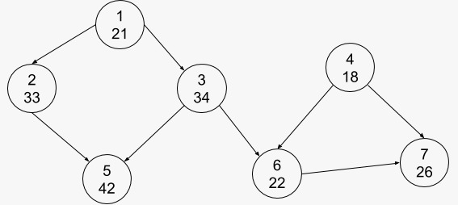

### <center> Trabalho Estrutura de Dados</center>

#### <center>Flávio Lúcio Corrêa Júnior </center>

**<center>Universidade Federal de Minas Gerais (UFMG) </center>**
**<center>Belo Horizonte - MG - Brazil</center>**

---

- ### **Sumário**:

  **1. Introdução**

  **2. Implementação**

  **3. Análise de complexidade**

  **4. Conclusão**

  **5. Bibliografia**

---

## 1 Introdução:

O trabalho consiste em modelar uma equipe de jogadores de Black Jack utilizando um grafo G(V, A), no qual V são os membros da equipe representados por um número de identificação e sua idade. Além disso, existe uma aresta (u, v) se e somente se o aluno u comanda o aluno v.

<center>



Exemplo de uma possível modelagem onde cada vértice armazena o seu número de identificação e sua idade

</center>

Em cima desta representação deve-se executar três tipos de operações:

- **SWAP**: O comando SWAP (S) - verifica se existe uma aresta entre os alunos A e B. Caso a relação anterior exista, troca a direção de uma aresta que representava que o aluno A comandava o aluno B para uma que representa que o aluno B comanda o aluno A. Essa troca só pode ser realizada se o resultado não ocasionar um ciclo. Caso um ciclo ocorra, o grafo permanece sem alteração;

- **COMMANDER**: O comando COMMANDER (C) - recebe como entrada um aluno A e responde a idade da pessoa mais jovem que comanda A (direta ou indireta);

- **MEETING**: o comando MEETING (M) - identifica uma possı́vel ordem de fala dos alunos em uma reunião.

Considerando todas as instruções necessárias o programa deve funcionar em tempo de O(V + A).

## 2 Implementação:

No geral, o programa desenvolvido aceita entradas contendo as informações sobre a equipe a ser modelada e as instruções a serem operadas, produzindo saídas de acordo com a especificação dos comandos acima.

### **2.1 Estruturas de dados:**

- **Vetor:**

  - Arranjos com elementos em posições sequenciais na memória. Permite operação de indexação com acesso à elementos em tempo constante. Tal estrutura foi usada para armazenar os objetos que compõem os nós do grafo. Dessa forma todas as manipulações de elementos nas listas de adjacências podem ser feitas com apenas os índices dos elementos deste vetor.

<center>


Exemplo de um vetor

</center>

- **Lista encadeada:**

  - Uma lista encadeada consiste em uma lista de células onde cada célula contém um apontador para o objeto armazenado e um outro apontador para a próxima célula da lista. Além disso, existem duas células especiais que indicam o início e o fim da lista respectivamente, são elas `head` e `tail`.

<center>


Exemplo de uma lista encadeada

</center>

- Na implementação do programa tal estrutura de dados foi usada para armazenar os vizinhos de cada vértice onde se existe uma aresta do vértice `u` para o vértice `v`, logo `v` está presente na lista de vizinhos de `u`.

- **Grafo:**

  - Um grafo é uma estrutura formada por dois conjuntos: um conjunto de chamadas vértices e um conjunto de arestas; cada aresta está associada a dois vértices: o primeiro é a ponta inicial do aresta e o segundo é a ponta final.

  - Para a solução do problema proposto foi utilizado um DAG (do inglês Grafo Acíclico Dirigido), ou seja, uma classe específica de grafos caracterizados por não conter cíclos e suas arestas serem dirigidas.

  - Escolheu-se a representação do grafo em forma de lista de adjacência, tal decisão foi baseada nas operações necessárias para executar as três instruções, bem como a restrição de complexidade assintótica dada (O (V+A)).

### **2.2 Classes:**

Para a resolução do problema implementou-se três classes que concentram a lógica das operações e exportam APIs que operam sobre as estruturas de dados descritas acima, são elas:

- **List:** classe que exporta uma API para realizar operações em uma lista encadeada

  - `int length();`
    - retorna o tamanho da lista
  - `bool empty();`
    - retorna um boleano indicando se a lista está vazia
  - `bool has(const T &value);`
    - retorna um boleano indicando se `value` está presente na lista
  - `int pos(const T &value);`
    - retorna a posição de `value` na lista
  - `void each(std::function<void(T &)> fn);`
    - executa a função parametrizada em cada elemento da lista
  - `void each_rev(std::function<void(T &)> fn);`
    - executa a função parametrizada em cada elemento da lista em ordem reversa
  - `void push_first(T value);`
    - incluiu `value` no início da lista
  - `void push_last(T value);`
    - incluiu `value` no final da lista
  - `T at(int position);`
    - retorna o n-ésimo elemento da lista
  - `T first();`
    - retorna o primeiro elemento da lista
  - `T last();`
    - retorna o último elemento da lista
  - `T pop_at(int position);`
    - remove o n-ésimo elemento da lista
  - `T pop_first();`
    - remove o primeiro elemento da lista
  - `T pop_last();`
    - remove o último elemento da lista

- **Graph:** classe que exporta uma API para realizar operações em um grafo

  - `bool has_node(int v);`
    - retorna um boleano indicando se o grafo contém um nó com índice `v`
  - `void new_node(int v, T value);`
    - cria um novo nó com índice `v` e valor `value`
  - `void remove_node(int v);`
    - remove o nó com índice `v`
  - `bool has_edge(int v1, int v2);`
    - retorna um boleano indicando se existe uma aresta direcionada de `v1` para `v2`
  - `void set_edge(int v1, int v2);`
    - cria uma aresta direcionada de `v1` para `v2`
  - `void remove_edge(int v1, int v2);`
    - remove uma aresta direcionada de `v1` para `v2`
  - `void bfs(int v, std::function<void(T &)> fn);`
    - executa um caminhamento em largura aplicando a função parametrizada em cada elemento
  - `void dfs(int v, std::function<void(T &)> fn);`
    - executa um caminhamento em profundidade aplicando a função parametrizada em cada elemento
  - `std::shared_ptr<List<T>> topological_sort();`
    - retorna uma lista contendo a ordenação topológica do grafo
  - `bool cyclic();`
    - retorna um boleano indicando se o grafo contém pelo menos um cíclo
  - `std::unique_ptr<Graph<T>> transpose();`
    - retorna uma instância do grafo transposto do original
  - `void print(std::function<std::string(T &)> to_string);`
    - imprime todos nós e suas respectivas listas de adjacência

- **Inst:** classe que exporta uma API para executar as instruções SWAP, COMMANDER e MEETING
  - `void exec_inst(std::ifstream &file);`
    - executa a próxima instrução presente em um arquivo parametrizado, esta podendo ser SWAP, COMMANDER ou MEETING

### **2.3 Algoritmos:**

Os algoritmos utilizados no programar foram escolhidos baseados nas regras e restrições para a resolução do problema. Dito isso, analisemos cada uma das instruções e suas respectivas escolhas de algoritmos:

- **SWAP:** o principal problema para executar tal instrução está na detecção de cíclos no grafo, pois na representação escolhida (lista de adjacência) a inserção de arestas é feita de maneira simples, basta **incluir uma nova célula na lista** de vizinhos. Da mesma forma, a verificação da existência, bem como a remoção de uma aresta qualquer também tem implementação simples, basta **percorrer a lista** de vizinhos do vértice. Por outro lado, a detecção de cíclos tem implementação um pouco sutíl. Aqui utiliza-se o algoritmo de caminhamento em grafos denominado **Busca em Profundidade** (DFS).

  - **Busca em Profundidade:** o algoritmo começa visitando um vértice e explora tanto quanto possível cada um dos seus ramos, antes de retroceder. A detecção de cíclo é feita mantendo um vetor simulando uma pilha de recursão e para cara nó visitado, verifica-se se o mesmo está presente neste vetor, ou seja, se este já foi visitado saindo de um mesmo nó antecessor em comum.

- **COMMANDER:** para esta instrução primeiro computa-se o **Grafo Transposto** e aplica-se, neste, um outro algoritmo de caminhamento em grafos denominado **Busca em Largura** (BFS), encontrando o membro de menor idade que comanda o nó escolhido.

  - **Grafo Transposto:** o grafo transposto G'(V,A') é computado de forma que para todo vértice no grafo original, inclu-se este vértice no grafo transposto e para cada aresta (u,v) no grafo original, inclui-se uma aresta (v, u) no grafo transposto.

  - **Busca em Largura:** o algoritmo começa visitando um vértice e explora todos os vértices vizinhos. Então, para cada um desses vértices mais próximos, explora-se os seus vértices vizinhos inexplorados e assim por diante.

- **MEETING:** a instrução MEETING consiste, basicamente, em percorrer, em ordem reversa, a lista resultante da **Ordenação Topológica** do grafo principal, imprimindo cada um de seus elementos.

  - **Ordenação Topológica:** é uma ordem linear dos nós de um DAG em que cada nó vem antes de todos nós para os quais este tenha arestas de saída.

### **2.4 Compilador:**

O compilador usado foi o GNU Compiler Collection, comando `g++` com a flag `-std=c++14` especificando o padrão da linguagem utilizado.

## 3 Análise de Complexidade:

Para realizar tal análise, vejamos a representação, em pseudo-códigos, do algoritmo para executar cada tipo de instrução:

- **SWAP:**

```
  FUN SWAP a b
    SE exiteAresta a b
    ENTAO
      removeAresta a b
      incluiAresta b a
      SE NAO grafoEhCiclico
      ENTAO
        imprime "S T"
        RETORNA

      removeAresta b a
      incluiAresta a b

    imprime "S N"
  FIM FUN

  SE existeAresta a b
  ENTAO
    SWAP a b
  SENAO
    SWAP b a
```

- **COMMANDER:**

```
transposto = gerarGrafoTransposto;
idadeMinima = MAX_IDADE;

FUN atualizaIdadeMinima idade
  SE idade < idadeMinima
  ENTAO
    idadeMinima = idade

executaBFS EM transposto PARA CADA NÓ atualizaIdadeMinima

imprime "C " + idadeMinima
```

- **MEETING:**

```
ordenacaoTopologica = calcularOrdenacaoTopologica;
PARA CADA no EM reverso(ordenacaoTopologica)
  imprime no.idade
```

### **3.1 Tempo de Execução:**

Dadas as seguintes complexidades assintóticas, já conhecidas, dos algoritmos:

- **Busca em Largura:** O(V+A)
- **Busca em Profundidade:** O(V+A)
- **Grafo Transposto:** O(V+A)
- **Ordenação Topológica:** O(V+A)
- **Existe Aresta:** O(V)
- **Remove Aresta:** O(V)
- **Inclui Aresta:** O(1)

- **SWAP:**

  - Percebe-se que no pior caso as seguintes operações são executadas:
    - **existeAresta** + **removeAresta** + **incluiAresta** + **grafoEhCiclico** + **removeAresta** + **incluiAresta**
    - **O(V)** + **O(V)** + **O(1)** + **O(V+A)** + **O(V)** + **O(1)**
    - **O(V+A)**

- **COMMANDER:**

  - Percebe-se que no pior caso as seguintes operações são executadas:

    - **gerarGrafoTransposto** + **executaBFS** \* **atualizaIdadeMinima**
    - **O(V+A)** + (**O(V+A)** x **O(1)**)
    - **O(V+A)**

- **MEETING:**

  - Percebe-se que no pior caso as seguintes operações são executadas:

    - **calcularOrdenacaoTopologica** + **imprimirNosOrdemReversa**
    - **O(V+A)** + **O(V)**
    - **O(V+A)**

### **3.2 Espaço:**

Dadas as seguintes complexidades de espaço, já conhecidas, dos algoritmos:

- **Grafo Transposto:** O(V+A)
- **Busca em Largura:** O(V)
- **Busca em Profundidade:** O(V)
- **Ordenação Topológica:** O(V)
- **Existe Aresta:** O(1)
- **Remove Aresta:** O(1)
- **Inclui Aresta:** O(1)

- **SWAP:**

  - **existeAresta** + **removeAresta** + **incluiAresta** + **grafoEhCiclico** + **removeAresta** + **incluiAresta**
  - **O(V)** + **O(V)** + **O(1)** + **O(V+A)** + **O(V)** + **O(1)**
  - **O(V+A)**

- **COMMANDER:**

  - **gerarGrafoTransposto** + **executaBFS** \* **atualizaIdadeMinima**
  - **O(V+A)** + (**O(V+A)** x **O(1)**)
  - **O(V+A)**

- **MEETING:**

  - **calcularOrdenacaoTopologica** + **imprimirNosOrdemReversa**
  - **O(V+A)** + **O(V)**
  - **O(V+A)**

### **3.3 Análise Experimental:**

Percebe-se que, de fato, a complexidade de tempo de execução é limitada superiormente por O(V+A), tal comportamento pode ser ilustrado no gráfico abaixo, onde para foi registrado a média e o desvio padrão dos tempos de execução para 50 testes com o número de vértices e arestas parametrizados.

OBS: a escolha do número de arestas foi baseada na relação do máximo número de arestas em um DAG, este, por sua vez, ocorre quando todo vértice possui uma aresta para todo os outros vértices à sua frente na ordenação topológica, e é `V * (V - 1) / 2`.

<center>


Análise experimental com a média e desvio padrão dos tempos de execução para diferentes entradas.

</center>

## 4 Conclusão:

- O trabalho prático proposto foi de grande utilidade para exercitar a implementação dos algoritmos vistos em aula e o melhor entendimento de como estes podem ser usados para a solução de possíveis problemas da vida real. Além disso, compreender o comportamento de tais algoritmos baseando-se em sua análise de complexidade.

## 5 Bibliografia:

- _Introduction to Algorithms - Second Edition, Cormen, Leiserson, Rivest, Stein_
- _Projeto de Algoritmos - Nivio Ziviani - 3a edição_
- _Wikipédia_
