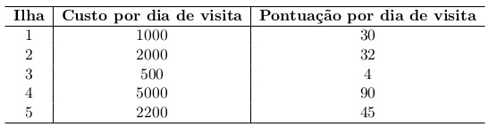
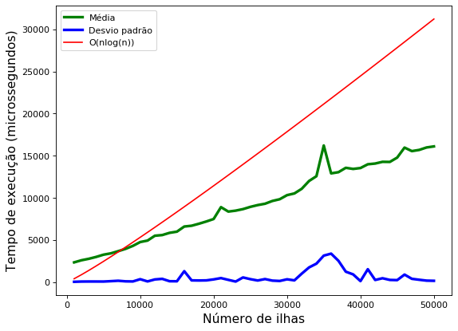
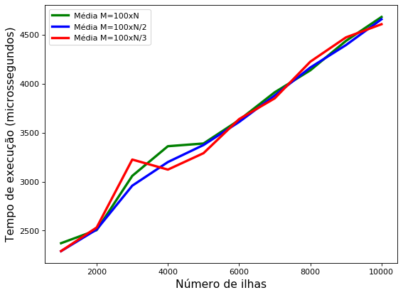
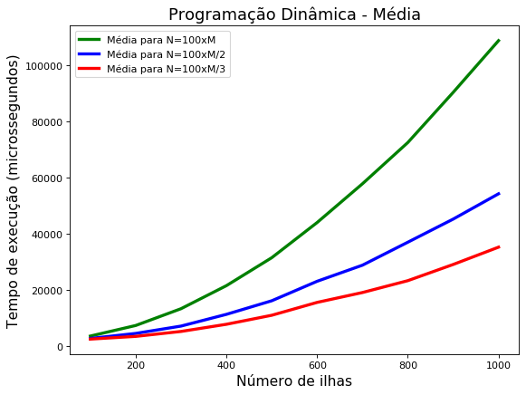
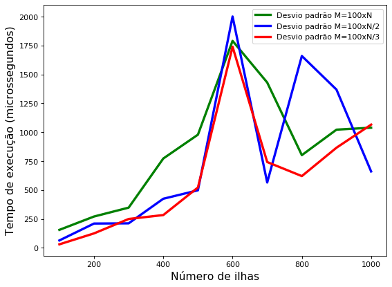

### <center> Trabalho Algoritmos 1</center>

#### <center>Flávio Lúcio Corrêa Júnior </center>

**<center>Universidade Federal de Minas Gerais (UFMG) </center>**
**<center>Belo Horizonte - MG - Brasil</center>**

---

- ### **Sumário**:

  **1. Introdução**

  **2. Implementação**

  **3. Análise de complexidade**

  **4. Análise experimental**

  **5. Prova de corretude**

  **6. Conclusão**

  **7. Bibliografia**

---

## 1 Introdução:

O trabalho consiste em, dado um valor inteiro N, que representa o valor máximo possı́vel a ser gasto e um conjunto M de ilhas com seus custos e pontuações por dia, desenvolver soluções:

1. **Utilizando algoritmo guloso**:

   - Maior pontuação possı́vel para um roteiro no qual pode haver repetições de ilhas (ficar mais de um dia na mesma ilha).
   - Quantidade de dias que durará a viagem.
   - O tempo de execução do algoritmo para esse problema não deve ser superior a **O(M log M)**.

1. **Utilizando programação dinâmica**:
   - Maior pontuação possı́vel para um roteiro no qual não pode haver repetições de ilhas.
   - Quantidade de dias que durará a viagem.
   - O tempo de execução do algoritmo para esse problema não deve ser superior a **O(N ∗ M)**.

<center>



Exemplo de custos e pontuações de 5 ilhas.

</center>

## 2 Implementação:

No geral, o programa desenvolvido aceita entradas contendo os inteiros N e M seguidos de M linhas representando os custos e pontuações, por dia de visita, respectivamente, produzindo como saida 2 linhas contendo a maior pontuação e o número de dias usando uma estratégia gulosa e programação dinâmica respectivamente.

### **2.1 Estruturas de dados:**

- **Vetor:**

  - Arranjos com elementos em posições sequenciais na memória. Permite operação de indexação com acesso à elementos em tempo constante. Tal estrutura foi usada para armazenar os custos e pontuações de cada ilha em que o i-ésimo elemento de cada arranjo representa o custo e a pontuação da iésima ilha. Dessa forma consegue-se encontrar informações referente a qualquer ilha em tempo constante.

<center>

<!--  -->

Exemplo de um vetor

</center>

- **Tupla:**

  - Uma tupla é uma estrutura de dados que permite agrupar informações que precisam ser armazenadas, e principalmente transportadas juntas, sem que tenha um semântica específica. Para resolver o problema em questão utiliza-se a `struct` `std::pair` que permite a simulação de tuplas com dois elementos na linguaguem `C++`.

  - Na implementação do programa tal estrutura de dados foi usada para agrupar o custo e pontuação referentes a cada ilha em um mesmo arranjo em que cada elemento é do tipo `std::pair<int, int>`.

### **2.2 Funções:**

Para a resolução do problema implementou-se duas funções que concentram a lógica e os algoritmos utilizados, são elas:

- **solve_greedy:** função que recebe quatro parâmetros, `n` (número de ilhas), `W` (valor disponível), `Vn[]` (arranjo de pontuações) e `Wn[]` (arranjo de custos), e retorna uma struct do tipo `std::pair<int, int>` contendo a maior pontuação e a quantidade de dias, na primeira e segunda posições, respectivamente, usando uma estratégia gulosa e permitindo a repetição de ilhas.

- **solve_dp:** função que recebe os mesmos parâmetros da função anterior e retorna uma struct do tipo `std::pair<int, int>` contendo a maior pontuação e a quantidade de dias, na primeira e segunda posições, respectivamente, usando uma estratégia com programação dinâmica sem permitir a repetição de ilhas.

### **2.3 Algoritmos:**

Os algoritmos utilizados no programa foram escolhidos baseados nas estratégias de programação utilizadas em cada função bem como suas restrições para o tempo de execução. Dito isso, analisemos cada uma das estratégias e seus respectivos algoritmos:

- **Guloso:** um algoritmo guloso realiza escolhas que parece ser a melhor no momento na esperança de que a mesma acarrete em uma solução ou prevenção de futuros problemas a nível global. Sob essa ótica, faz-se necessário a especificação de um parâmetro qualitativo para cada um dos possíveis itens de tal forma que o algoritmo guloso escolha o item o qual tal parâmetro apresenta o melhor valor no momento de escolha. Em nosso caso, os itens são ilhas, e o parâmetro qualitativo é representado pela relação `pontuação / custo`, logo um algoritmo guloso para resolver o problema seria:

```
FUNCAO guloso(ilhas, valor_disponivel):
  ORDDENA_DECRESCENTE_PARAMETRO_QUALITATIVO(ilhas)

  INICIALIZA pontos = 0 E dias = 0

  PARA CADA ilha EM ilhas:
    SE valor_disponivel >= ilha.custo ENTAO:
      dias = valor_disponivel DIV ilha.custo
      pontos = ilha.ponto * (valor_disponivel DIV ilha.custo)
      valor_disponivel = valor_disponivel MOD ilha.custo

    SE valor_disponivel == 0 ENTAO:
      PARE!

  RETORNA (pontos, dias)
```

- **Programação dinâmica:** método para a resolução de problemas nos quais a solução ótima pode ser computada a partir da solução ótima previamente calculada e memorizada, de forma a evitar recálculo, de outros subproblemas que, sobrepostos, compõem o problema original. Dessa forma, podemos evidenciar a solução ótima do problema geral em função de soluções ótimas de subproblemas, para isso encontramos a equação de Bellman que modela o problema em questão:

- Sejam `Vn` o arranjo com as pontuações e `Wn` o arranjo com os custos de cada ilha, `i` representando o um conjunto de ilhas `0...i` em que cada ilha `i` tem seu custo na posição `i-1` do arranjo `Wn` e sua pontuação na posição `i-1` do arranjo `Vn` e `w` representando o valor disponível para ser gasto.

```
SE i = 0 OU w = 0 ENTAO:
  OPT(i, w) = 0
SENAO SE Wn[i - 1] > w ENTAO:
  OPT(i, w) = OPT(i - 1, w)
SENAO:
  OPT(i, w) = MAX(Vn[i - 1] + OPT(i - 1, w - Wn[i - 1]), OPT(i - 1, w))
```

- O primeiro caso occore pois, se temos um conjunto com 0 ilhas ou 0 valor disponível, não conseguimos nenhuma pontuação, no segundo caso, se o custo da ilha `i-1` for maior que o valor disponível, então a ilha `i-1` não pode estar presente na solução ótima. Já no terceiro caso, o custo da ilha `i-1` é menor ou igual o valor disponível, logo, a solução ótima é composta pelo máximo entre duas opções: incluimos ou não a ilha `i-1`. Se incluirmos, então a solução máxima é composta por `Vn[i-1]` (pontuação da ilha `i-1`) somado a solução ótima do conjunto `0...i-1` e com `w - Wn[i-1]` (custo da ilha `i-1`) valor disponível, o que é intuitivo se pensarmos que para a ilha na posição `i-1` gastamos `Wn[i-1]` e, por conseguinte, ganhamos `Vn[i-1]` pontos. Caso contrário, apenas pegamos a solução ótima do conjunto de `0...i-1` ilhas.

- Uma vez modelada a equação de Bellman, adota-se uma abordagem bottom-up para a resolução dos subproblemas que compõem a solução geral. Para isso, utiliza-se uma matriz `M[n][W]` em que cada célula `(i, j)` contém a solução ótima OPT(i, j). Logo, um algoritmo para resolver o problema consiste em iterar para `i = 0...n` e `j = 0...W` e preencher `M[i][j] = OPT(i, j)`

- **Programação dinâmica: Otimização de memória:** observando o algoritmo supracitado, percebe-se que para preencher M[i][j] precisamos conhecer, além dos arranjos Vn e Wn, apenas a solução da linha anterior. Ou seja, se estivermos em M[i][j] e incluimos o i-ésimo elemento, então movemos j-Wn[i] posições para trás na linha anterior e se excluimos o i-ésimo elemento, então movemos para a j-ésima coluna da linha anterior. Dessa forma, percebe-se que estamos utilizando apenas duas linhas consecutivas, logo um algoritmo guloso para resolver o problema seria:

```
FUNCAO programacao_dinamica(numero_ilhas, valor_disponivel, pontos, custos):
  INICIALIZA opt[valor_disponivel + 1]

  PARA i = 0...valor_disponivel+1
    opt[i] = (0, 0)

  PARA i = 0...numero_ilhas-1:
    PARA j = valor_disponivel...custos[i]:

      SE pontos[i] + opt[j - custos[i]].first >= opt[j].first ENTAO:
        opt[j] = (pontos[i] + opt[j - custos[i]].first, opt[j - custos[i]].second + 1)
      SENAO
        opt[j] = (opt[j].first, opt[j].second)

  RETORNA opt[W]
```

### **2.4 Por que estratégia gulosa?**

- Para o primeiro problema, achar a maior pontuação possı́vel para um roteiro no qual pode haver repetições de ilhas, o algoritmo guloso apresenta uma heurística satisfatória que visa maximizar os pontos ficando o máximo possível na ilha com o melhor custo benefício. Para este caso, a estratégia gulosa é de simples implementação e apresenta resultados que satisfazem, razoavelmente, os requisitos do problema.

### **2.5 Por que programação dinâmica?**

- No segundo caso, repetição de ilhas não é permitida, de fato, aqui uma solução gulosa poderia distorcer bastante os resultados esperados, uma vez que temos diversos subproblemas que se sobrepoem, fazendo-se necessário o cálculo de todas as possibílidades. O que é feito de maneira elegante com programação dinâmica e memoização, apresentando uma solução um pouco sutil, porém que sempre computa uma solução ótima (ver 5.2).

### **2.6 Compilador:**

O compilador usado foi o GNU Compiler Collection, comando `g++` com a flag `-std=c++14` especificando o padrão da linguagem utilizado.

## 3 Análise de Complexidade:

Para realizar tal análise, vejamos a representação, em pseudo-código, dos algoritmos para cada um dos problemas:

- **Guloso:**

```
FUNCAO guloso(ilhas, valor_disponivel):
  ORDDENA_DECRESCENTE_PARAMETRO_QUALITATIVO(ilhas)

  INICIALIZA pontos = 0 E dias = 0

  PARA CADA ilha EM ilhas:
    SE valor_disponivel >= ilha.custo ENTAO:
      dias = valor_disponivel DIV ilha.custo
      pontos = ilha.ponto * (valor_disponivel DIV ilha.custo)
      valor_disponivel = valor_disponivel MOD ilha.custo

    SE valor_disponivel == 0 ENTAO:
      PARE!

  RETORNA (pontos, dias)
```

- **Programação Dinâmica:**

```
FUNCAO programacao_dinamica(numero_ilhas, valor_disponivel, pontos, custos):
  INICIALIZA opt[valor_disponivel + 1]

  PARA i = 0...valor_disponivel+1
    opt[i] = (0, 0)

  PARA i = 0...numero_ilhas-1:
    PARA j = valor_disponivel...custos[i]:

      SE pontos[i] + opt[j - custos[i]].first >= opt[j].first ENTAO:
        opt[j] = (pontos[i] + opt[j - custos[i]].first, opt[j - custos[i]].second + 1)
      SENAO
        opt[j] = (opt[j].first, opt[j].second)

  RETORNA opt[W]
```

### **3.1 Tempo de Execução:**

- **Guloso:**

  - Primeiro ordenamos o arranjo com as informações sobre as ilhas de acordo com a relação `pontuação / custo` o que pode ser feito em `O(M log M)` onde `M` é o número de ilhas presentes no vetor. Logo apos, iteramos pelo vetor e para cada iteração fazemos operações matemáticas e lógicas com complexidade assintótica constante, ou seja `O(M)\*O(1) = O(M)`. Portanto, a complexidade total do algoritmo é dado pela soma das duas operações executadas, ou seja: `O(M log M) + O(M) =` **O(M log M)**.

- **Programação Dinâmica:**

  - Primeiro inicializamos o vetor `opt[i] = (0, 0)` para `i = 0...valor_disponivel+1`, o que é feito em `O(M)`, então executamos dois loops para cada `i = 0...numero_ilhas-1` e para cada `j = valor_disponivel...custos[i]`, realizando operações em tempo constante em cada iteração, ou seja, `N*M` iterações - onde `N` é o valor máximo disponivel, e `M` é o número de ilhas - com operações em tempo constante em cada iteração, o que implica em um tempo de execução `O(N * M)`, portanto a complexidade total é dada oela soma das duas operações executadas: `O(M) + O(N _ M) =` **O(N \* M)**.

### **3.2 Espaço:**

- **Guloso:**

  - Aqui apenas utilizamos as variáveis auxiliares `pontos` e `dias` o que implica em uma complexidade de espaço `O(1)`.

- **Programação Dinâmica:**

  - O algoritmo utilizado apresenta uma complexidade de espaço `O(N)` (`N` é o valor máximo disponivel) pois apenas utilizamos um arranjo `opt[valor_disponivel]` para armazenar as soluções ótimas de cada iteração.

## **4 Análise Experimental:**

- **Guloso:**

  - Percebe-se que, de fato, a complexidade de tempo de execução é limitada superiormente por O(M log M), tal comportamento pode ser ilustrado no gráfico abaixo, onde foi registrado a média e o desvio padrão dos tempos de execução para 20 testes com o número de ilhas fixo e valor disponível, custos e pontuações variadas.

  - **OBS**: este cenário foi repetido para M = 1000, 2000, 3000, . . . , 50000, gerando o grafico abaixo.

<center>



Análise experimental com a média e desvio padrão dos tempos de execução para diferentes entradas.

</center>

- Além disso, percebe-se que para diferentes valores de `valor maximo disponível` a complexidade assintótica não muda, o que evidencia que a complexidade do tempo de execução depende apenas do número de ilhas e é O(M log M).

- **OBS**: valores de M e N estão invertidos na legenda do gráfico. Ou seja, somente neste caso, N representa o número de ilhas e M o valor disponivel.

<center>



Análise experimental com a média e desvio padrão dos tempos de execução para diferentes entradas.

</center>

- **Programação Dinâmica:**

  - Da mesma forma, availamos que a complexidade de tempo de execução do segundo algoritmo é limitada superiormente por O(M \* N), o que pode ser comprovado pela ilustração no gráfico abaixo, onde foi registrado a média dos tempos de execução para 10 testes com o número de ilhas (M) fixo e valor disponível (N) em função de M, custos e pontuações foram variados aleatóriamente.

  - **OBS**: este cenário foi repetido para M = 100, 200, 300, . . . , 1000, gerando o grafico abaixo.

<center>



Análise experimental com a média dos tempos de execução para diferentes entradas.

</center>

- Avaliamos também o comportamento do desvio padrão para as médias representadas acima. O que, embora pareça ser um pouco caótico, demonstra-se muito pequeno para influenciar no comportamento das médias.

<center>



Análise experimental com a média dos tempos de execução para diferentes entradas.

</center>

- **Conhecer mais lugares X Tempo de estadia no local:**
  - Conclui-se, portanto, que para maximizar o número de ilhas visitadas o algoritmo com programação dinâmica de fato possui uma melhor abordagem uma vez que este não considera a repetição de ilhas para dois dias diferentes e sempre dá preferência para a solução que maximiza a quantidade total de pontos obtidos. Por outro lado, quando o interesse é maximizar o tempo de estadia no local, o algoritmo guloso demonstra retornar uma melhor solução, pois este opta sempre pela ilha com o melhor custo x benefício e fica, nesta, o máximo de dias possível.

## 5 Prova de corretude:

- **5.1 Guloso:**

  - Tal estratégia, neste caso, não produz uma solução ótima que maximiza a pontuação das ilhas. Para provar este fato, basta analisar o seguinte contra exemplo:

  - Seja `M = 3`, `N = 13`, `Vn = [10, 6, 5]`, `Wn = [10, 7, 6]`, `D = Vn/Wn = [10/10, 6/7, 5/6]`, o algoritmo guloso pegaria primeiro a melhor proporção `pontuação / custo` que é para a ilha na posição `0` (`Vn[0] = 10` e `Wn[0] = 10`). Mas se isso acontece, visitariamos apenas esta ilha pois `N - Wn[0] = 3` o que não cobre o custo de nenhuma outra ilha, logo a pontuação feita seria `10`. Entretanto, a solução ótima é, certamente, optar pelas duas outras ilhas, pois `N - Wn[1] = 5` e `N - Wn[1] - Wn[2] = 0` e a pontuação total seria `Vn[1] + Vn[2] = 11 > 10` (pontuação retornada pelo algoritmo guloso).

  - Esse tipo de resultado é bem comum para resoluções de problemas com paradigmas gulosos, pois, nem sempre a soma de soluções ótimas locais levam para uma solução ótima global, o que, de fato, acontece com o problema em questão.

- **5.2 Programação Dinâmica:**

  - Por definição `OPT(0, x) = OPT(y, 0) = 0`, para quaisquer `x` e `y`. Agora, seja `n > 0` e `w > 0`, suponha, por indução, que o algoritmo `OPT(i, j)` computa a solução ótima para todo `i < n e j < w`. Pela hipótese indutiva, sabemos que `OPT(n, w-Wn[n-1])` é de fato solução ótima, bem como `OPT(n-1, w)`. Portanto, pela equação de Bellman modelada, se `Wn[n - 1] > w` entao `OPT(n, w) = OPT(n - 1, w)`, que é solução ótima pela hipótese, uma vez que não podemos incluir a ilha `i-1`, caso contrário `OPT(n, w) = MAX(Vn[n - 1] + OPT(n - 1, w - Wn[n - 1]), OPT(n - 1, w))`, ou seja, a solução que maximiza o número de pontos dentre as duas possíveis escolhas, inclui-se ou não a ilha `n-1`, mas como `OPT(n - 1, w - Wn[n - 1])` e `OPT(n - 1, w)` são ótimas pela hipótese, `OPT(n, w)` também é.

## 6 Conclusão:

- O trabalho prático proposto foi de grande utilidade para exercitar a implementação dos paradigmas de programação vistos em aula e o melhor entendimento de como estes podem ser usados para a solução de possíveis problemas da vida real. Além disso, compreender o comportamento de tais algoritmos baseando-se em sua análise de complexidade e prova de corretude.

## 7 Bibliografia:

- _Introduction to Algorithms - Second Edition, Cormen, Leiserson, Rivest, Stein_
- _Algorithm Design - Jon Kleinberg and Éva Tardos_
- _Wikipédia_
