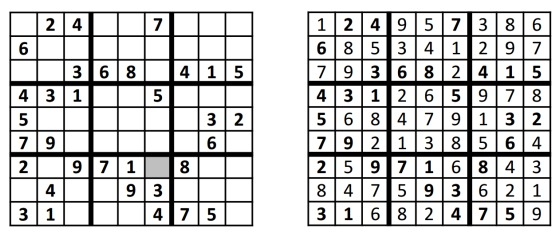

### <center> Trabalho Algoritmos 1</center>

#### <center>Flávio Lúcio Corrêa Júnior </center>

**<center>Universidade Federal de Minas Gerais (UFMG) </center>**
**<center>Belo Horizonte - MG - Brasil</center>**

---

- ### **Sumário**:

1. **Introdução**
2. **Implementação**
3. **Análise de complexidade**
4. **Análise experimental**
5. **Conclusão**
6. **Bibliografia**

---

## 1 Introdução:

O Sudoku é um puzzle de lógica baseado, na sua versão tradicional, em números. É composto por um “quadrante numérico” de linhas e colunas com algumas células pré-preenchidas. A sua resolução consiste em preencher cada célula de modo a não haver números repetidos em cada linha, coluna, ou subquadrante.

O trabalho consiste em, dada uma instância de um Sudoku de tamanho N×N, desenvolver um algoritmo que informe se o Sudoku possui ou não solução e apresente a solução.

<center>



Exemplo de um Sudoku 9x9.

</center>

## 2 Implementação:

No geral, o programa desenvolvido aceita entradas contendo três inteiros, em que N representa o tamanho (N x N) da tabela do Sudoku, I representa a quantidade de colunas de cada quadrante e J representa a quantidade de linhas de cada quadrante. Nas próximas NxN linhas, é dada a instância do Sudoku. A saída é composta por uma linha indentificando se foi encontrada uma solução ("solução") ou não ("sem solução") seguida da instância do Sudoku resolvida ou semiresolvida.

Para a resolução do Sudoku, transformou-se, o mesmo, em um problema de coloração de grafos, como este é um problema NP-Completo, torna-se inviável a busca de um algoritmo polinomial que sempre resolva qualquer instância do mesmo. Dessa forma, fez-se o uso de heurísticas que apresentam soluções polinomiais para a maioria dos casos.

### **2.1 Transformação:**

Antes de apresentar a solução para o problema de coloração de grafos, e consequentemente para o Sudoku, precisamos apresentar como foi modelada uma instância genérica de um Sudoku NxN em uma instância de coloração de grafos.

Seja M uma matriz NxN representando uma instância genérica do Sudoku. Para cada célula de M criou-se um nó em um grafo não direcionado G = (V, E) e, para cada dois vértices em V, sejam v1 e v2, criou-se uma aresta (v1, v2) se, e somente se, em M, v1 e v2 estão na mesma coluna, mesma linha ou no mesmo quadrante onde um quadrante é definido para inteiros I (quantidade de colunas) e J (quantidade de linhas). Então afirma-se: a instância do Sudoku M tem solução se, e somente se, G pode ser colorido com no máximo N diferente cores de forma que dois vértices adjacentes não são coloridos com mesma cor.

**Prova**:

- Seja S, uma solução para M, um vetor de NxN inteiros onde cada elemento i de S corresponde a uma célula em M. Agora considere o arranjo S' em G composto pelos vérticis correspondentes as célula de S. Para cada inteiro i E S atribua uma cor i ao vértice correspondente em S'. Como S é solução de M, não existem duas células na mesma linha, coluna ou quadrante com o mesmo inteiro i e, por conseguinte, não existem dois vértices em S' com arestas entre si e com a mesma cor. Portanto, S' é solução para G.

- Inversamete, seja S' uma solução para a coloração em G, atribua às células correspondentes em S números de 1 a N de tal forma que cada cor em S' represente um número em S. Dessa forma S não terá números iguais associados a células da mesma coluna, linha ou quadrante, ou seja S é solução para M.

### **2.2 Heurísticas:**

A heurística utilizada é consiste em uma abordagem gulosa, conhecida na literatura pelo nome de seu criador Welsh-Powell. Basicamente, o algoritmo foca em escolher, cuidadosamente, o próximo nó a ser colorido. Uma vez que este é colorido, sua cor nunca mais muda. Dessa forma, o algoritmo de Welsh-Powell sugere que deve-se escolher o nó com o maior grau de saturação, ou seja, o vértice cujo número de nós vizinhos coloridos seja o maior possível. E, assim, colorindo-o com a menor cor disponível.

```
FUNCAO colorir_grafo(grafo, cores, numero_total_vertices):

  INICIALIZA coloridos = quantidade de nós pré definidos na matriz do Sudoku

  ENQUANTO coloridos < numero_total_vertices
    ACHE o vertice com o máximo grau de saturação

    ACHE a menor cor disponível para este vertice (considerando os vértices vizinhos)

    SE não existe nenhuma disponível entre as N cores
      RETORNE falso

    COLORA o vertice com a cor encontrada
    INCREMENTE o número de coloridos

  RETORNE verdadeiro
```

### **2.2 Por que Welsh-Powell?**

O uso de tal heurística se da, pois, para qualquer algoritmo de coloração gulosa, uma nova cor precisa ser incluida sempre que um vértice se econtra com todas as cores disponíveis em seus vizinhos, logo, a única maneira de colorir tal vértice é incluindo mais uma cor. Dessa forma, naturalmente aparece a necessidade de evitar tal situação indesejada, o que é feito pela tentativa de visitar, e colorir, todos os vértices com grau de saturação alto, reduzindo, assim, o risco de precisar adicionar uma nova cor e, consequentemente, não encontrar solução para o Sudoku, caso ultrapasse o limite de N cores.

### **2.3 Estruturas de dados:**

- **Vetor:**

  - Arranjos com elementos em posições sequenciais na memória. Permite operação de indexação com acesso à elementos em tempo constante. Tal estrutura foi usada para armazenar a matriz do Sudoku e a matriz de adjacência do grafo correspondente.

<center>


Exemplo de um vetor

</center>

### **2.4 Funções:**

Para a resolução do problema implementou-se duas funções que concentram a lógica e os algoritmos utilizados, são elas:

- **transform:** Função que recebe cinco parâmetros, `matrix` (vetor de 2 dimensões representando uma instância do Sudoku), `graph` (vetor de 2 dimensões representando a matriz de adjacência do grafo correspondente), `N` (ordem do Sudoku), `C` (quantidade de colunas em cada quadrante) e `R` (quantidade de linhas em cada quadrante). Tal função aplica a transformação descrita acima na matriz parametrizada produzinho um grafo com NxN vértices em `graph`.

- **color_graph:** função que recebe uma instância de um grafo em uma matriz de adjacência `graph`, um vetor `colors` de NxN elementos representando as cores para cada vértice de `graph` e um inteiro `N` representando a ordem da instância do Sudoku correspondente. Aplicando a heurística descrita acima, o procedimento tenta colorir `graph` com no máximo `N` cores, armazenando a coloração no vetor `colors` e retornando um boleano indicando se houve sucesso ou não na coloração.

### **2.5 Compilador:**

O compilador usado foi o GNU Compiler Collection, comando `g++` com a flag `-std=c++14` especificando o padrão da linguagem utilizado.

## 3 Análise de Complexidade:

Para realizar tal análise, considere a descrição da transformação e heurística apresentadas anteriormente:

### **3.1 Tempo de Execução:**

- **Transformação:**

  - Primeiramente, iteramos sobre as células da matriz que representa o Sudoku criando os vértices no grafo correspondente. Dada uma entrada de ordem `N`, tal operação é feita em tempo proporcional ao quadrado de N, `O(N^2)`. Então, para cada vértice, criamos arestas para os elementos na mesma linha, `O(N)`, e coluna, `O(N)`, o que é feito iterando sobre as células da mesma linha/coluna de um vértice qualquer. Por último, temos que criar arestas para os elementos do mesmo quadrante, tal operação leva em conta que os índices das células na matriz do Sudoku que estão no mesmo quadrante sempre terão um arredondamento para cima igual quando dividos pelos limitadores `I` e `J` que definem a ordem de cada quadrante. Por exemplo: para `N = 4`, `I = 2` e `J = 2`, todos índices `i` e `j` (começando em `1`) no primeiro quadrante terão uma divisão arredondada igual a `1` para `i` e `j`, já no segundo quadrante a divisão para `i` continua `1` e para `j` fica igual a `2`. O mesmo vale para o terceiro e quarto quadrante (divisão para `i=2`, `j=1` e no 4º `i=2`, `j=2`). Dessa forma basta condicionar nosso loop de acordo com essa definição, o que implica em um tempo de execução proporcional a `I*J`, `O(I*J)`. Concluindo, temos uma complexidade assintótica`O(N^3)`para a criação das arestas em colunas e linhas e`O(N*I*J)`para arestas entre células de um mesmo quadrante, a complexidade total é dade pela soma das três operações:`O(N^2) + O(N^3) + O(N*I*J)`.

- **Heuristica:**

  - A heurística consiste em escolher uma cor para cada vértice, portanto, iteramos sobre os vértices do grafo G = (V, E) onde |V| = N\*N e N é a ordem da instância do Sudoku. Então executamos as seguintes operações `O(N^2)` vezes:
    - achar o vértice que tenha o maior grau de saturação, tal tarefa necessita uma nova iteração sobre os vértices, armazenando o índice do vértice que apresenta o maior grau, `O(N^2)`.
    - achar a menor cor disponível para o vértice encontrado, v, o que é feito iterando sobre os vizinhos de v e encontrando uma cor `c` a tal que nenhum vértice adjacente a v esteja colorido com `c`, `O(N^2)`.
  - A complexidade assintótica total é dada pela soma das duas operações: `O(N^2*N^2) + O(N^2*N^2) = O(N^4)`

### **3.2 Espaço:**

- **Transformação:**

  - A memória auxiliar utilizada para a transformação é proporcional ao tamanho do grafo criado, como este é representado por uma matriz de adjacência (arranjo de 2 dimensões) com `N^2xN^2` células a complexidade assintótica de memória utilizada é `O(N^4)`.

- **Heuristica:**

  - Para executar a coloração no grafo usamos 2 arranjos auxiliares, um para representar as cores para cada vértice e um para representar as cores dos vértices adjacentes a um vértice qualquer. O primeiro tem N^2 elements (um para cada vértice) e o segundo N (um para cada possível vizinho), logo a complexidade assintótica de memória utilizada é dominada por `O(N^2)`.

## **4 Análise Experimental:**

- **Guloso:**

  - Percebe-se que, de fato, a complexidade de tempo de execução é limitada superiormente por `O(M log M)`, tal comportamento pode ser ilustrado no gráfico abaixo, onde foi registrado a média e o desvio padrão dos tempos de execução para 20 testes com o número de ilhas fixo e valor disponível, custos e pontuações variadas.

  - **OBS**: este cenário foi repetido para `M = 1000, 2000, 3000, . . . , 50000`, gerando o grafico abaixo.

<center>


  
</center>

- Além disso, percebe-se que para diferentes valores de `valor maximo disponível` a complexidade assintótica não muda, o que evidencia que a complexidade do tempo de execução depende apenas do número de ilhas e é `O(M log M)`, ou seja, não depende de `N`.

- **OBS**: valores de `M` e `N` estão invertidos na legenda do gráfico. Ou seja, somente neste caso, `N` representa o número de ilhas e `M` o valor disponivel.

<center>


</center>

- **Programação Dinâmica:**

  - Da mesma forma, avaliamos que a complexidade do tempo de execução do segundo algoritmo é limitada superiormente por `O(M * N)`, o que pode ser comprovado pela ilustração no gráfico abaixo, onde foi registrado a média dos tempos de execução para 10 testes com o número de ilhas (`M`) fixo e valor disponível (`N`) em função de `M`, custos e pontuações foram variados aleatóriamente.

  - **OBS**: este cenário foi repetido para `M = 100, 200, 300, . . . , 1000`, gerando o grafico abaixo.

<center>


</center>

- Avaliamos também o comportamento do desvio padrão para as médias representadas acima. O que, embora pareça ser um pouco caótico, demonstra-se muito pequeno para influenciar no comportamento das médias.

<center>


</center>

- **Conhecer mais lugares X Tempo de estadia no local:**
  - Conclui-se, portanto, que para maximizar o número de ilhas visitadas o algoritmo com programação dinâmica de fato possui uma melhor abordagem uma vez que este não considera a repetição de ilhas para dois dias diferentes e sempre dá preferência para a solução que maximiza a quantidade total de pontos obtidos. Por outro lado, quando o interesse é maximizar o tempo de estadia no local, o algoritmo guloso demonstra retornar uma melhor solução, pois este opta sempre pela ilha com o melhor custo x benefício e fica, nesta, o máximo de dias possível.

## 5 Conclusão:

- O trabalho prático proposto foi de grande utilidade para exercitar a implementação dos paradigmas de programação vistos em aula e o melhor entendimento de como estes podem ser usados para a solução de possíveis problemas da vida real. Além disso, compreender o comportamento de tais algoritmos baseando-se em sua análise de complexidade e prova de corretude.

## 6 Bibliografia:

- _Introduction to Algorithms - Second Edition, Cormen, Leiserson, Rivest, Stein_
- _Algorithm Design - Jon Kleinberg and Éva Tardos_
- _Wikipédia_
