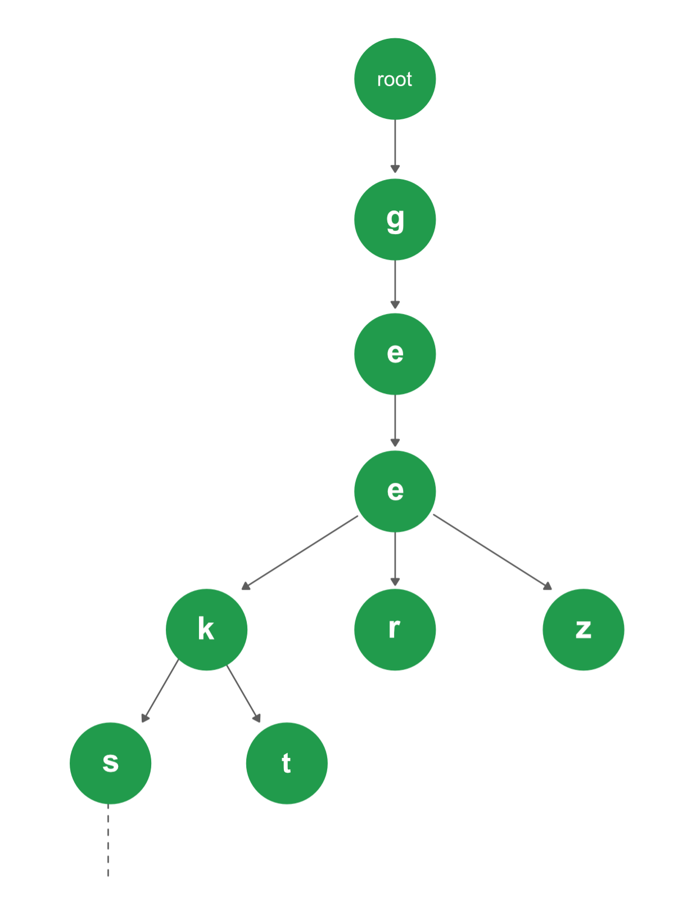

### 
 Trabalho Estrutura de Dados

#### 
Flávio Lúcio Corrêa Júnior 

**
Universidade Federal de Minas Gerais (UFMG) 
**
**
Belo Horizonte - MG - Brazil
**

---

- ### **Sumário**:

  **1. Introdução**

  **2. Implementação**

  **3. Análise Experimental**

  **4. Conclusão**

  **5. Bibliografia**

---

## 1 Introdução

O trabalho consiste em implementar um programa que decodifique textos em código Morse usando uma árvore de pesquisa digital. Para isso, usaremos a seguinte tabela para mapear os caracteres alfanuméricos para as suas respectivas codificações em Morse:

|     |       |     |     |      |     |     |      |     |     |      |
| --- | :---: | --- | --- | ---- | --- | --- | ---- | --- | --- | ---- |
| 0   | ----- |     | A   | ..-. |     | K   | -.-  |     | U   | ..   |
| 1   | .---- |     | B   | -... |     | L   | .-.. |     | V   | ...- |
| 2   | ..--- |     | C   | -.-. |     | M   | -.   |     | W   | .--  |
| 3   | ...-- |     | D   | -    |     | N   | --.  |     | X   | -..- |
| 4   | ....- |     | E   | .    |     | O   | ---  |     | Y   | -.-- |
| 5   | ..... |     | F   | .-   |     | P   | .--. |     | Z   | --.. |
| 6   | -.... |     | G   | --   |     | Q   | --.- |     |
| 7   | --... |     | H   | .... |     | R   | .-.  |     |
| 8   | ---.. |     | I   | ..-  |     | S   | ...  |     |
| 9   | ----. |     | J   | .--- |     | T   | -..  |     |

Cada letra do alfabeto é codificada através de pontos (.) e traços (-) em código Morse. A letra A, por exemplo, é codificada por ..-. na variação do código adotada.

O objetivo deste trabalho é praticar os conceitos de árvore e pesquisa binária vistos nas aulas de Estruturas de Dados.

## 2 Implementação:

No geral, o programa desenvolvido aceita entradas contendo a mensagem codificada em Morse onde existe um espaço entre cada letra e uma barra (/) entre cada palavra. Ou seja, a mensagem `.-.. ..- ...- .-. . / . ... -.. --- ...` seria decodificada como `LIVRE ESTOU`.

### **2.1 Estruturas de dados:**

- **Trie:**

  - Uma trie (pronuncie trái), também conhecidas como árvores digitais ou árvores de prefixos, é um tipo de árvore usado para implementar um array associativo em que as chaves são normalmente cadeias de caracteres.

  - Exemplo de uma trie:

    

      
    

  - Na implementação do programa a estrutura de dado foi usada para armazenar os alfanuméricos onde os pontos e traços do caracter codificado são encontrados conforme você "desce" os níveis da árvore.

### **2.2 Classes:**

- A lógica de decódificação e operações sobre a estrutura de dados está concentrada na classe `Decoder` onde são exportadas as APIs `decode_msg` e `print_trie` para processar as entradas do programa.

### **2.3 Principais Funções:**

- `insert()`: realiza a inserção de elementos na trie.
- `search()`: realiza a pesquisa de elementos na trie.
- `decode_msg()`: recebe uma variável do tipo std::string contendo uma mensagem codificada em Morse e retorna outra do mesmo tipo com a respectiva mensagem decodificada.

### **2.4 Compilador:**

O compilador usado foi o `g++` com a flag `-std=c++14`.

## 3 Análise de Complexidade:

- Para analisar a complexidade de tempo e espaço da decodificação de uma mensagem qualquer vejamos as seguintes funções:

- **Tempo de Execução**

  - `search`: a pesquisa de um elemento na trie é feita com tempo proporcional à M, onde M é o número de caracteres da string a ser pesquisada,
  - `insert`: dado que a inserção de um elemento é básicamente uma pesquisa mais a inserção do novo nó, o tempo de execução é O(M)
  - `decode_msg`: como cada letra códificada em Morse tem no máximo 5 caracteres, temos uma complexidade de tempo de execução proporcional N\*5 = O(N) onde N é a quantidade de letras na mensagem decodificada.

- **Espaço**
  - A complexidade de espaço de uma trie é dada por O(M\*W) onde M é a quantidade de caracteres na chave do nó e W é a quantidade de nós na árvore. Dessa forma, na implementação do programa como temos chaves com no máximo 5 caracteres a complexidade de memória é O(5\*W) = O(W).

## 4 Conclusão:

- Acredito que o trabalho prático proposto foi de grande utilidade para exercitar a implementação das árvores de pesquisa e o melhor entendimento de como esta pode ser usada para a solução de possíveis problemas na vida real. Além disso, entender os possíveis melhores e piores casos da estrutura de dado, bem como as dificuldades comuns encontradas na sua implementação.

## 5 Bibliografia:

- Ziviani, N. (2006). _Projetos de Algoritmos com Implementações em Java e C++:_
- _Stack Overflow_
- _Wikipedia_
- _Github_
